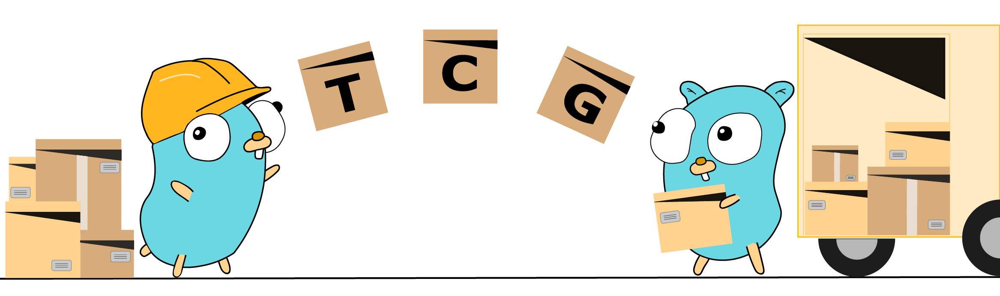

<p>
  <a href="http://www.gwos.com/" target="blank"></a>
</p>

[](LICENSE)
[](https://app.travis-ci.com/gwos/tcg.svg?branch=master)
[](https://goreportcard.com/report/github.com/gwos/tcg)
[](https://godoc.org/github.com/gwos/tcg)

The Transit Connection Generator (TCG). TCG contains two sub-systems/packages:

1. Transit agent - connects and sends metrics to Groundwork Monitor
2. Controller service - an http server for external control of agent


#### Table of Contents

1. [Dependencies](#dependencies)
2. [Building](#building)
3. [Running](#running)
4. [Docker](#docker)
5. [Testing](#testing)
6. [Environment variables](#envvar)


<a name="dependencies"></a>
## Dependencies

The TCG project is built with Go Modules. See `go.mod` for a list of dependencies. Here are some main frameworks used by this project:

1. [Gin Web Framework](github.com/gin-gonic/gin)

    >Gin is a web framework written in Go (Golang).
    It features a martini-like API with much better performance,
    up to 40 times faster.

        github.com/gin-gonic/gin

2. [Sessions](github.com/gin-contrib/sessions)

    > Gin middleware for session management with multi-backend support.

        github.com/gin-gonic/contrib/sessions

3. [NATS Streaming System](nats.io)

    > [About NATS](nats.io/about)

        github.com/nats-io/go-nats-streaming
        github.com/nats-io/nats-streaming-server/server
        github.com/nats-io/nats-streaming-server/stores

4. [Envconfig](github.com/kelseyhightower/envconfig)

    > Package envconfig implements decoding of environment variables based
    on a user defined specification. A typical use is using environment variables
    for configuration settings.

        github.com/kelseyhightower/envconfig

5. [Go-Cache](github.com/patrickmn/go-cache)

   > Go-Cache is an in-memory key:value store/cache similar to memcached
    that is suitable for applications running on a single machine. Its major advantage
    is that, being essentially a thread-safe map[string]interface{} with expiration times,
    it doesn't need to serialize or transmit its contents over the network.
    Any object can be stored, for a given duration or forever, and the cache can be safely
    used by multiple goroutines.

        github.com/patrickmn/go-cache

6. [Testify](github.com/stretchr/testify)

    > Go code (golang) set of packages that provide many tools for testifying that your
    code will behave as you intend.

        github.com/stretchr/testify

7. [Zerolog](github.com/rs/zerolog)

    > The zerolog package provides a fast and simple logger dedicated to JSON output.

        github.com/rs/zerolog

8. [Gopsutil](github.com/shirou/gopsutil)

    > The challenge is porting all psutil functions on some architectures.

        github.com/shirou/gopsutil

9. [Gin-Swagger](github.com/swaggo/gin-swagger)
    
    > Gin Gonic middleware to automatically generate RESTful API documentation with Swagger 2.0.
                                                        
        github.com/swaggo/gin-swagger
        
    > Generate 'docs.go' for Swagger UI
        
        $ swag init
    
    > Swagger url:

        {host}:{port}/swagger/index.html

<a name="building"></a>
## Building

```
$ cd tcg
$ go build .
```


### Building tcg shared module:

```
$ go build -ldflags "-X 'github.com/gwos/tcg/config.buildTime=`date --rfc-3339=s`' -X 'github.com/gwos/tcg/config.buildTag=<TAG>'" -buildmode=c-shared -o libtransit/libtransit.so libtransit/libtransit.go
```

#### or use Makefiles

### Building Connectors:

LINUX:
```
$ cd connectors/<connector>
$ go build -ldflags "-X 'github.com/gwos/tcg/config.buildTime=`date --rfc-3339=s`' -X 'github.com/gwos/tcg/config.buildTag=<TAG>'"
```

OS X:
```
$ cd connectors/<connector>
$ go build -ldflags "-X 'github.com/gwos/tcg/config.buildTime=`date -u +"%Y-%m-%dT%H:%M:%SZ"`' -X 'github.com/gwos/tcg/config.buildTag=<TAG>'"
```

## Building Connectors for OS Targets (Cross Compiling)
```
env GOOS=linux GOARCH=386 go build -ldflags "-X 'github.com/gwos/tcg/config.buildTime=`date -u +"%Y-%m-%dT%H:%M:%SZ"`' -X 'github.com/gwos/tcg/config.buildTag=8.1.0.1'"
```
To view supported platforms use commands
```
go tool dist list
go tool dist list -json
go tool dist list -json | jq '.[] | select(.CgoSupported == true)'
```

## Installing as a service 
To enable:      
```
sudo systemctl enable tcg-elastic
```
To start:       
```
sudo systemctl start tcg-elastic
```
Show status:    
```
sudo systemctl status tcg-elastic
```
To stop:        
```
sudo systemctl stop tcg-elastic
```
To disable:     
```
sudo systemctl disable tcg-elastic
```
To reconfigure: 
```
sudo systemctl daemon-reload
```
To tail:
```
journalctl -f -u tcg-elastic
```

<a name="running"></a>
## Running

```
$ cd tcg
$ go run .
```


<a name="docker"></a>
## Docker

### Build image:

    $ docker build -t groundworkdevelopment/tcg --build-arg GITHUB_TOKEN .


<a name="testing"></a>
## Testing

The [gotests](https://github.com/cweill/gotests) tool can generate Go tests.

### Run package tests:

>With logs:

    $ go test -v ./<package_one>/ ./<package_two>/
    
### Run integration tests:

>For integration tests you must provide environment variables for Groundwork Connection.

    $ TCG_GWCONNECTIONS_0_USERNAME=remote TCG_GWCONNECTIONS_0_PASSWORD=remote \
        go test -v ./integration/


### Examples:

    $ go test -v ./config/ ./services/

    $ go test -v ./libtransit/

    $ go test -v $(go list ./... | grep -v tcg/integration)

    $ GOFLAGS="-count=1" \
        TCG_GWCONNECTIONS_0_USERNAME=remote TCG_GWCONNECTIONS_0_PASSWORD=remote \
        TCG_JAEGERTRACING_AGENT=localhost:6831 \
        TCG_CONNECTOR_LOGLEVEL=3 \
        go test -v ./integration/


<a name="envvar"></a>
## Environment variables


### LIBTRANSIT

Defines the path to `libtransit.so` library in docker container and tests.

    $ export LIBTRANSIT=/path/to/libtransit.so


### TCG

By default, the config file is looked for in the work directory as `tcg_config.yaml`.

The path to config file and any config option can be overridden with env vars:

    $ export TCG_CONFIG=/path/to/tcg_config.yaml
    $ export TCG_CONNECTOR_NATSSTORETYPE=MEMORY

For more info see package `config` and tests.

## Run golangci-lint locally:

    $ golangci-lint --config ./.golangci.yaml run ./... --deadline=2m
