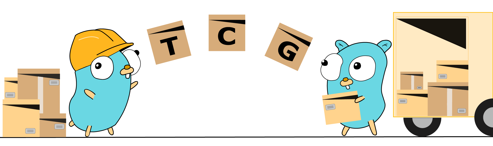

<p>
  <a href="http://www.gwos.com/" target="blank"></a>
</p>

[](LICENSE)
[](https://app.travis-ci.com/gwos/tcg.svg?branch=master)
[](https://goreportcard.com/report/github.com/gwos/tcg)
[](https://godoc.org/github.com/gwos/tcg)

The Transit Connection Generator (TCG). TCG contains two sub-systems/packages:

1. Transit agent - connects and sends metrics to Groundwork Monitor
2. Controller service - an http server for external control of agent


#### Table of Contents

1. [Dependencies](#dependencies)
2. [Building](#building)
3. [Running](#running)
4. [Docker](#docker)
5. [Testing](#testing)
6. [Environment variables](#envvar)


<a name="dependencies"></a>
## Dependencies

The TCG project is built with Go Modules. See `go.mod` for a list of dependencies. Here are some main frameworks used by this project:

- [NATS Streaming System](nats.io)

    > [About NATS](nats.io/about)

        github.com/nats-io/nats.go
        github.com/nats-io/nats-server

- [Gin Web Framework](github.com/gin-gonic/gin)

    >Gin is a web framework written in Go (Golang).
    It features a martini-like API with much better performance,
    up to 40 times faster.

        github.com/gin-gonic/gin

- [Gin-Swagger](github.com/swaggo/gin-swagger)

    > Gin Gonic middleware to automatically generate RESTful API ocumentation with Swagger 2.0.

        github.com/swaggo/gin-swagger

    > Generate 'docs.go' for Swagger UI

        go run github.com/swaggo/swag/cmd/swag@latest init --parseDependency --parseInternal --exclude ./connectors/

    > Swagger url:

        {host}:{port}/swagger/index.html

- [Env](github.com/caarlos0/env)

    > A simple, zero-dependencies library to parse environment variables into structs

        github.com/caarlos0/env

- [Zerolog](github.com/rs/zerolog)

    > The zerolog package provides a fast and simple logger dedicated to JSON output.

        github.com/rs/zerolog


<a name="building"></a>
## Building

```
cd tcg
go build .
```


### Building C shared library:

```
go build -ldflags "-X 'github.com/gwos/tcg/config.buildTime=`date --rfc-3339=s`' -X 'github.com/gwos/tcg/config.buildTag=<TAG>'" -buildmode=c-shared -o libtransit/libtransit.so libtransit/libtransit.go
```

#### or use Makefiles

### Building Connectors:

LINUX:
```
CGO_ENABLED=1 go build -v -o tcg -ldflags "-X 'github.com/gwos/tcg/config.buildTime=`date --rfc-3339=s`' -X 'github.com/gwos/tcg/config.buildTag=<TAG>'"
```

OS X:
```
CGO_ENABLED=1 go build -v -o tcg -ldflags "-X 'github.com/gwos/tcg/config.buildTime=`date -u +"%Y-%m-%dT%H:%M:%SZ"`' -X 'github.com/gwos/tcg/config.buildTag=<TAG>'"
```

## Building Connectors for OS Targets (Cross Compiling)
```
env GOOS=linux GOARCH=386 CGO_ENABLED=1 go build -v -o tcg -ldflags "-X 'github.com/gwos/tcg/config.buildTime=`date -u +"%Y-%m-%dT%H:%M:%SZ"`' -X 'github.com/gwos/tcg/config.buildTag=<TAG>'"
```
To view supported platforms use commands
```
go tool dist list
go tool dist list -json
go tool dist list -json | jq '.[] | select(.CgoSupported == true)'
```

## Installing as a service
To enable:
```
sudo systemctl enable tcg-elastic
```
To start:
```
sudo systemctl start tcg-elastic
```
Show status:
```
sudo systemctl status tcg-elastic
```
To stop:
```
sudo systemctl stop tcg-elastic
```
To disable:
```
sudo systemctl disable tcg-elastic
```
To reconfigure:
```
sudo systemctl daemon-reload
```
To tail:
```
journalctl -f -u tcg-elastic
```

<a name="running"></a>
## Running

```
cd tcg
go run .
```


<a name="docker"></a>
## Docker

The Dockerfile has five stages:

| Stage | Base | Purpose |
|---|---|---|
| `deps` | `golang:1-alpine3.23` | Download and cache Go modules |
| `build-libtransit-tests` | `golang:1-bookworm` | Run unit tests; build libtransit (CGO, Debian) |
| `build` | `golang:1-alpine3.23` | Build TCG binary and all connectors |
| `dist` | `scratch` | Libtransit artifacts + connector binaries (consumed by Nagios build) |
| `prod` | `gw8base-alpine:master` | Production image — no Go runtime, self-contained binary |

```bash
# build and test
docker build -t groundworkdevelopment/tcg .

# skip unit tests
docker build --build-arg SUPPRESS_TEST=1 -t groundworkdevelopment/tcg .

# build dist image only (libtransit + connectors, used by Nagios)
docker build --target dist -t groundworkdevelopment/tcg-dist .

# public build — no access to the private gw8base image:
# build the production image on a stock public base instead
docker build --build-arg BASE_IMG=alpine:3.23 -t tcg .
```

Override base images with `--build-arg`:

| ARG | Default | Description |
|---|---|---|
| `GOLANG_ALPINE` | `golang:1-alpine3.23` | Alpine Go builder |
| `GOLANG_DEBIAN` | `golang:1-bookworm` | Debian Go builder (libtransit requires CGO) |
| `BASE_IMG` | `groundworkdevelopment/gw8base-alpine:master` | Production base image |

The default `BASE_IMG` is GroundWork's private `gw8base-alpine`. Because tcg is a
public project, 3rd-party builders without access to that image can point
`BASE_IMG` at any public Alpine base (e.g. `alpine:3.23`). The entrypoint is
self-contained in this repo (`docker_cmd.sh`, `docker_cmd.d/_inc`,
`docker_cmd.d/20_signal_handler`, `docker_cmd.d/90_tcg_wrapper`), and when
`BASE_IMG` is **not** `gw8base-alpine` the prod stage `apk add`s the runtime deps
that base would otherwise provide (`bash`, `ca-certificates`, `curl`, `procps`).

### Runtime

The image ships its own `/docker_cmd.sh` + `docker_cmd.d/_inc` + `20_signal_handler` (vendored from gw8base so the entrypoint works on any base): `docker_cmd.sh` sources `_inc`, which sources the numbered snippets, then `exec`s the CMD. On a `gw8base-alpine` base the inherited `40_atop` / `60_ulg_cacerts` / `80_entrypoint_cmd` snippets run as well; a public base has only the vendored snippets. The Dockerfile adds:

- **`/docker_cmd.d/90_tcg_wrapper`** — selects the connector binary (`/app/tcg-<connector>`) based on the CMD arg, seeds `tcg_config.yaml` into the `/tcg/<connector>/` volume, then runs the connector under a healthcheck-based watchdog (`TCG_RESTART_ON_CRASH`).
- **`/app/docker_cmd.sh`** — symlink to `/docker_cmd.sh`, preserved for back-compat with existing `gwos/gw8` docker-compose files that pass `/app/docker_cmd.sh` as the entrypoint.

Default `CMD` is `["/docker_cmd.sh", "apm-connector"]`. Override with a different connector via `docker run image /docker_cmd.sh <connector>-connector` or a docker-compose `entrypoint:` override.

| Variable | Description |
|---|---|
| `TCG_RESTART_ON_CRASH` | If `true` (default), the watchdog restarts the connector when its `/api/v1/identity` healthcheck fails |
| `TCG_CONNECTOR_CONTROLLERADDR` | Address the watchdog probes (default `127.0.0.1:8099`) |
| `ATOP`, `ENTRYPOINT_CMD*` | Honored only on a `gw8base-alpine` base (via its `40_atop` / `80_entrypoint_cmd` snippets); not present on a public base |


<a name="testing"></a>
## Testing

### Run package tests:

>With logs:

    go test -v ./<package_one>/ ./<package_two>/

### Run integration tests:

>For integration tests you must provide environment variables for Groundwork Connection. Also have to deal with TLS certs: get it in local trust storage or suppress check.

    TCG_TLS_CLIENT_INSECURE=TRUE \
        TCG_GWCONNECTIONS_0_USERNAME=remote TCG_GWCONNECTIONS_0_PASSWORD=remote \
        go test -v ./integration/


### Examples:

    go test -v ./config/ ./services/

    go test -v ./libtransit/

    go test -v $(go list ./... | grep -v tcg/integration)

    GOFLAGS="-count=1" \
        TCG_TLS_CLIENT_INSECURE=TRUE \
        TCG_GWCONNECTIONS_0_USERNAME=remote TCG_GWCONNECTIONS_0_PASSWORD=remote \
        TCG_CONNECTOR_LOGCOLORS=TRUE TCG_CONNECTOR_LOGLEVEL=3 \
        OTEL_EXPORTER_OTLP_ENDPOINT=http://localhost:4317 \
        TCG_CONNECTOR_AGENTID=TEST11 \
        go test -failfast -v ./integration/

    GOFLAGS="-count=1" \
        TCG_TLS_CLIENT_INSECURE=TRUE \
        TCG_GWCONNECTIONS_0_USERNAME=remote TCG_GWCONNECTIONS_0_PASSWORD=remote \
        TCG_CONNECTOR_LOGCOLORS=TRUE TCG_CONNECTOR_LOGLEVEL=3 \
        __OTEL_EXPORTER_OTLP_ENDPOINT=http://localhost:4317 \
        __TCG_HTTP_CLIENT_TIMEOUT_GW=120s \
        __TEST_FLAG_CLIENT=true \
        TEST_RESOURCES_COUNT=40 TEST_SERVICES_COUNT=100 \
        TCG_CONNECTOR_BATCHMETRICS=1s TCG_CONNECTOR_BATCHMAXBYTES=204800  TCG_CONNECTOR_NATSMAXPAYLOAD=40920 \
        go test -benchtime=10x -benchmem -run=^$ -bench ^BenchmarkE2E$  ./integration/ \
        | grep _STATS


<a name="envvar"></a>
## Environment variables


### LIBTRANSIT

Defines the path to `libtransit.so` library in docker container and tests.

    export LIBTRANSIT=/path/to/libtransit.so


### TCG config variables

By default, the config file is looked for in the work directory as `tcg_config.yaml`.

The path to config file and any config option can be overridden with env vars:

    export TCG_CONFIG=/path/to/tcg_config.yaml
    export TCG_CONNECTOR_NATSSTORETYPE=MEMORY

For more info see package `config` and tests.


### Other variables

There are additional variables supported:

    * OTEL_EXPORTER_OTLP_ENDPOINT=http://jaegertracing:4317
    * TCG_HTTP_CLIENT_TIMEOUT=10s
    * TCG_HTTP_CLIENT_TIMEOUT_GW=120s
    * TCG_INVENTORY_NOEXT=true
    * TCG_SUPPRESS_DOWNTIMES=true
    * TCG_SUPPRESS_EVENTS=true
    * TCG_SUPPRESS_INVENTORY=true
    * TCG_SUPPRESS_METRICS=true


## Run golangci-lint locally:

    go install github.com/golangci/golangci-lint/cmd/golangci-lint@v1.54.2
    ~/go/bin/golangci-lint --config ./.golangci.yaml run ./... --deadline=2m
